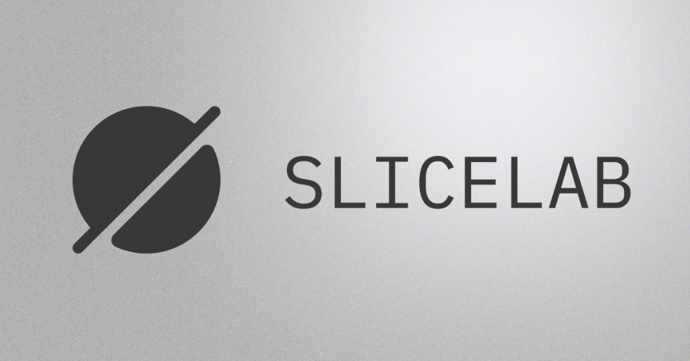

<p align="center">
  <a href="https://slicelab.pxl8.studio" title="Open SliceLab">
    
  </a>
</p>

# SliceLab

**Slice audio into samples in your browser.** Drop a long recording, auto-detect slice points (or slice to a grid), tweak fades and filenames, export a **ZIP of WAVs**, sketch layered patterns in the **loop builder**, explore **granular playback** on the **Grains** tab, and **combine slices** into one-shot composites on the **Oneshots** tab (layer or sequence, optional **batch generate** with ZIP + manifest). Processing runs in the browser—your files stay on your device.

**Live app:** [slicelab.pxl8.studio](https://slicelab.pxl8.studio)

---

## Features

| | |
| --- | --- |
| **Detection** | Transient peaks, RMS energy gates, tempo **beat grid** (BPM + subdivision), **equal** splits, or **manual** mode: optional **slice region** (where exports start/end) plus cuts on the waveform |
| **Waveform** | Master waveform with slice markers; preview playhead and slice highlight while you listen |
| **Fades** | Per-slice fade-in / fade-out to reduce clicks |
| **Naming** | Indexed names (`smpl_001`…) or **hex**-style names, with a custom **prefix** |
| **Export** | One-click **ZIP** of 16-bit mono WAV slices |
| **Loop builder** | Step sequencer: **8 / 16 / 32 steps per bar**, **1–8 bars** per pattern, layers + per-layer hit rate / pitch, swing, time signature; **Random** defaults to repeating bar 1 with variation on the **last bar**; optional per-layer **Custom bar variation** + **Spread** (light / heavy / full random); optional loop WAV download |
| **Grains** | Granular “cloud” from your slices, delay/reverb, 7-band EQ, live scope/spectrum, **record to WAV** |
| **Oneshots** | Stack or sequence multiple slices into one WAV; per-clip trim, reverse, gain, offsets; **Randomize**; **Batch generate** for many randomized combinations (max 100), pool exclusions, configurable sequence gap range, ZIP download with `manifest.json` and optional project-folder save |
| **Project folder** (optional) | On supported desktop browsers (Chrome, Edge, Arc), connect a folder so exports and a **source** copy of loaded audio go into `source/`, `exports/samples/`, `exports/loops/`, `exports/grains/`, `exports/oneshots/` (numbered single oneshot WAVs and batch ZIPs). Otherwise exports use normal browser downloads |
| **Appearance** | **Invert** in the top bar toggles a near-black palette vs. the default light UI; your choice is saved in the browser |

---

## Quick start

```bash
npm install
npm run dev
```

Open [http://localhost:3000](http://localhost:3000).

### Production build

```bash
npm run build
npm start
```

---

## How to use

1. **Load audio** — Decode in-browser (common formats supported by the Web Audio API, e.g. WAV, MP3, OGG).
2. **Pick a detection mode** and tune sensitivity, gaps, BPM, or slice count as needed.
3. **Set fades and naming** (prefix + index or hex scheme).
4. **Analyze** — Slices appear on the waveform and in the slice grid.
5. **Preview** slices or the full file; use **Download zip** when you are happy with the cuts.
6. **Loop builder** (after slices exist) — Set **steps per bar** (8–32), **bars** (pattern length), assign slices from the pool, layers, swing, and meter; use **Random** / **Randomize all** (default: groove through the second-to-last bar, fill on the last) or enable **Custom bar variation** + **Spread** per layer; play or export a loop WAV.
7. **Grains** (after slices exist) — Start the grain cloud, shape texture and space, use EQ if you like, then record the output to WAV when needed.
8. **Oneshots** (after at least two slices) — Choose **Layer** or **Sequence**, edit clips, preview, **Export WAV**; open **Batch generate** for randomized multi-slice combinations, then download a ZIP (check rows to include). Use the floating **help** button (bottom-right) for full documentation.

On first visit, supported browsers may offer a **project folder** so files are written in one place; you can skip and use downloads only, or change this later from the top bar (**Project · …**).

**Note:** The UI is aimed at **desktop/laptop** viewports; narrow screens show a short message to use a larger display.

---

## Stack

- [Next.js](https://nextjs.org/) 16 (App Router) · TypeScript · React 19  
- [Web Audio API](https://developer.mozilla.org/en-US/docs/Web/API/Web_Audio_API) — decode, slice, preview, and pattern audio on the client  
- [JSZip](https://stuk.github.io/jszip/) — ZIP downloads in the browser  
- [Recharts](https://recharts.org/) — grain EQ response curve  
- [next-themes](https://github.com/pacocoursey/next-themes) — persisted light / inverted appearance  
- [File System Access API](https://developer.mozilla.org/en-US/docs/Web/API/File_System_Access_API) — optional on-disk project layout (Chromium desktop)  
- IBM Plex Mono / IBM Plex Sans  

---

## Repo layout (high level)

| Path | Role |
| --- | --- |
| `app/` | Routes, layout, metadata, global styles |
| `app/components/` | UI (waveform, slice grid, loop builder, grains, oneshots, batch modal, sidebar, onboarding, …) |
| `app/lib/oneshotBuild.ts` | Composite buffer build (layer / sequence) |
| `app/lib/oneshotBatch.ts` | Batch plan sampling, shared random clip params |
| `app/context/ProjectContext.tsx` | Project folder connection, save notices, export routing |
| `app/hooks/useAudioEngine.ts` | Audio context, playback, export |
| `app/lib/audio.ts` | Detection, buffers, waveform drawing, WAV encoding |
| `app/lib/projectFolder.ts` | FS Access helpers, IndexedDB handle persistence, export paths |
| `app/providers.tsx` | Theme provider (default light, **Invert** toggles dark) |
| `public/` | Static assets (logo, favicon, …) |

Design tokens and marketing notes for matching SliceLab’s look elsewhere live in **`skill.md`**.

The social / Open Graph image used in metadata lives at **`app/opengraph-image.png`** (same asset as in the banner above).
